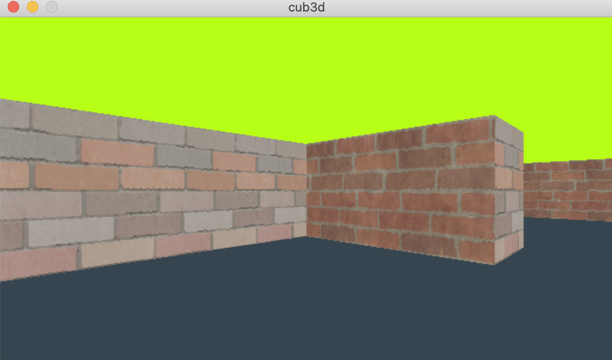

# **cub3D**

## **cub3D 소개** 
**cub3D** 
> 레이캐스팅을 활용한 1인칭 3d 프로그램

**cub3D 기능**
1. w s a d를 이용하여 플레이어 상하좌우 이동
2. 방향키 좌우를 이용하여 플레이어의 방향 전환
3. 128 x 128 벽 이미지 사용
4. 레이캐스팅을 이용한 1인칭 3D 구현

[**cub3D 과제내용**]() 

## **cub3D 실행** 

    make
    ./cub3d example00.cub

